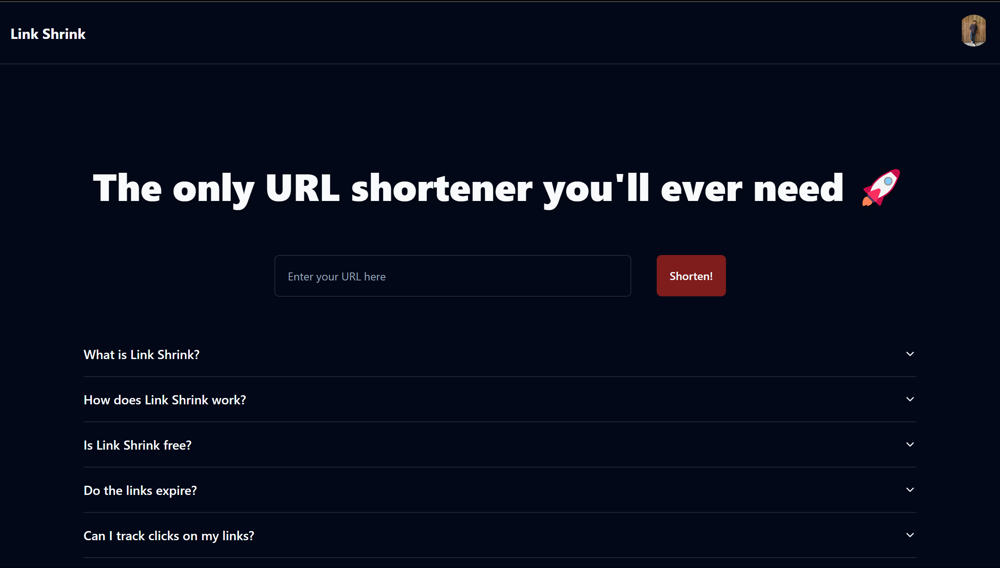
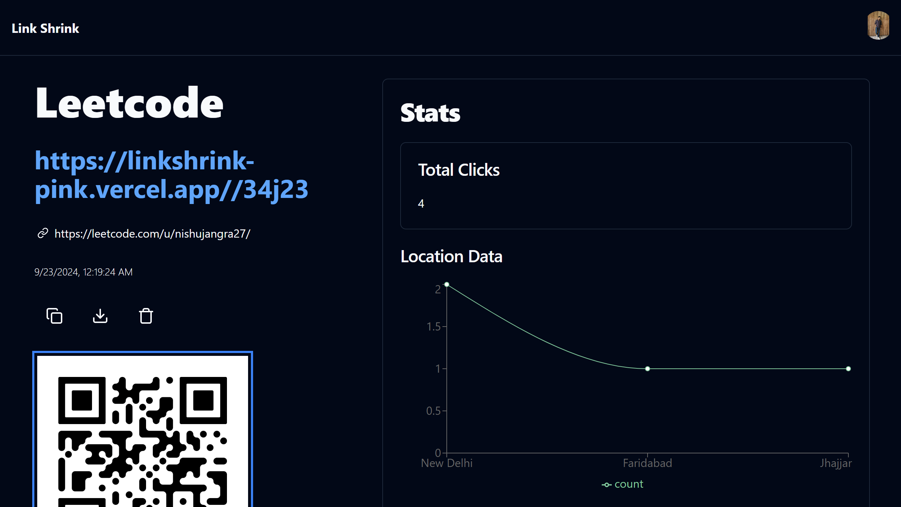

# Link Shrink - URL Shortener

**Link Shrink** is a fast and efficient URL shortener built with **Vite + React** on the frontend and **Supabase** as the backend for storing URLs and tracking click analytics. The project uses **Tailwind CSS** for styling and **Shadcn** for elegant UI components, providing users with a seamless experience to shorten URLs, create custom aliases, and view click statistics in real-time.

## Features
- **Shorten URLs**: Instantly convert long URLs into short, easy-to-share links.
- **Custom Aliases**: Create personalized short URLs for branding or simpler sharing.
- **Real-Time Analytics**: Track click data, referrers, and geographic insights for each link.
- **No Expiry**: Links remain active unless manually deleted by the user.
- **Secure & Efficient**: Built with Supabase for fast and secure data management.
- **Beautiful UI**: Styled using Tailwind CSS and Shadcn UI components for a modern and responsive design.

## Tech Stack
- **Frontend**: Vite, React.js, Tailwind CSS, Shadcn (UI Components)
- **Backend**: Supabase (PostgreSQL-based for storage and analytics)
- **Deployment**: Vercel (frontend) and Supabase for backend services

## Installation

1. Clone the repository:
   ```bash
   git clone https://github.com/nishujangra/url-shortener.git
   ```
2. Navigate to the project directory:
   ```bash
   cd url-shortener
   ```
3. Install the dependencies:
   ```bash
   npm install
   ```
4. Set up your environment variables. Create a `.env` file in the root directory and add the following:
   ```bash
    VITE_SUPABASE_URL=your-supabase-url
    VITE_SUPABASE_ANON_KEY=your-supabase-anon-key
    VITE_APP_DOMAIN=your-domain-name
   ```
5. Start the development server:
   ```bash
   npm run dev
   ```

6. Visit `http://localhost:5173` to use the app locally.

## Usage

1. **Shorten a URL**: Enter a long URL, click "Shrink Link," and instantly get a shortened version.
2. **Custom Alias**: Optionally, create a custom alias for your link to make it more memorable.
3. **Analytics Dashboard**: Access real-time analytics for each link, showing the number of clicks, referrers, and geographic data.

## Screenshots

### Homepage


### Analytics Dashboard


## Contributing

We welcome contributions! Feel free to submit pull requests or open issues to improve Link Shrink.

